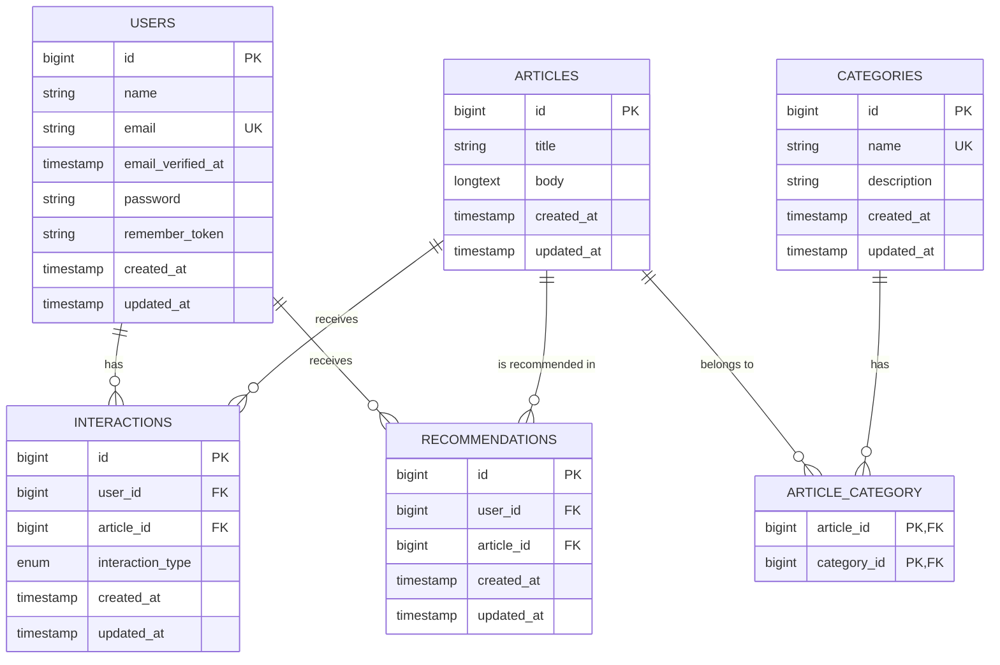

# Laravel Article Recommendation System

A sophisticated article recommendation system built with Laravel that provides personalized article recommendations to users based on their interactions and preferences.

## Table of Contents

- [Overview](#overview)
- [Features](#features)
- [System Architecture](#system-architecture)
- [Routes](#routes)
- [Design Patterns](#design-patterns)
- [Performance Optimizations](#performance-optimizations)
- [Installation](#installation)
- [Usage](#usage)

## Overview

This Laravel-based recommendation system analyzes user interactions with articles (views, likes) to generate personalized article recommendations. The system uses a content-based filtering approach, recommending articles from categories that users have shown interest in through their recent interactions.

## Features

- **User Authentication**: Secure user authentication system for both regular users and administrators
- **Article Management**: Full CRUD operations for articles with category associations
- **User Interaction Tracking**: Records user views and likes on articles
- **Personalized Recommendations**: Generates article recommendations based on user interaction history
- **Admin Dashboard**: Comprehensive admin interface for content and user management
- **Responsive Design**: Mobile-friendly interface for optimal user experience
- **Category Management**: Organize articles into categories for better content organization
- **User Activity Tracking**: Monitor user engagement with content
- **Like/Unlike Functionality**: Allow users to express preferences for articles
- **Real-time Recommendation Updates**: Recommendations update after each user interaction
- **User Profile Management**: Users can manage their personal information
- **Admin User Management**: Administrators can manage user accounts
- **Robust Error Handling**: Comprehensive error logging and exception handling

## System Architecture

The application follows a clean, modular architecture that separates concerns and promotes maintainability:

### Core Components

1. **Models**: Represent database entities and their relationships
   - `User`: Regular application users
   - `Admin`: Administrative users with elevated privileges
   - `Article`: Content items that can be recommended
   - `Category`: Classification for articles
   - `Interaction`: Records user interactions with articles
   - `Recommendation`: Stores generated recommendations for users

2. **Controllers**: Handle HTTP requests and responses
   - `ArticleController`: Manages article display and operations
   - `InteractionController`: Records and processes user interactions
   - `RecommendationController`: Handles recommendation generation and display
   - `ProfileController`: Manages user profile operations
   - Admin controllers for backend management

3. **Services**: Contain business logic
   - `RecommendationService`: Core service that implements the recommendation algorithm
   - `InteractionService`: Manages user interactions with articles
   - `ArticleService`: Handles article-related operations
   - `ProfileService`: Manages user profile operations

### Database Schema

Below is the Entity-Relationship Diagram (ERD) showing the database structure and relationships:



The diagram shows the following relationships:
- Users can have multiple interactions and receive multiple recommendations
- Articles can receive multiple interactions and be recommended multiple times
- Articles can belong to multiple categories through the article_category pivot table
- Categories can have multiple articles through the article_category pivot table

## Routes

The application is organized with a clear routing structure that separates user and admin functionality:

### Public Routes

- `/`: Welcome page
- `/articles/{article}`: View a specific article (accessible to all users)

### User Routes

All user routes are protected by the `auth` middleware to ensure only authenticated users can access them:

- `/dashboard`: User dashboard displaying articles (main page after login)
- `/profile`: User profile management
- `/articles/{article}/view`: Record a view interaction for an article
- `/articles/{article}/like`: Toggle like status for an article
- `/recommendations`: View personalized article recommendations

### Admin Routes

Admin routes are prefixed with `/admin` and protected by custom middleware to ensure only administrators can access them:

- `/admin/login`: Admin login page
- `/admin/dashboard`: Admin dashboard (main page after admin login)

#### Admin Content Management

- `/admin/articles`: List all articles
- `/admin/articles/create`: Create a new article
- `/admin/articles/{article}/edit`: Edit an existing article
- `/admin/articles/{article}`: Update an article (PUT)
- `/admin/articles/{article}`: Delete an article (DELETE)

#### Admin Category Management

- `/admin/categories`: List all categories
- `/admin/categories/create`: Create a new category
- `/admin/categories/{category}/edit`: Edit an existing category
- `/admin/categories/{category}`: Update a category (PUT)
- `/admin/categories/{category}`: Delete a category (DELETE)

#### Admin User Management

- `/admin/users`: List all users
- `/admin/users/create`: Create a new user
- `/admin/users/{user}/edit`: Edit an existing user
- `/admin/users/{user}`: Update a user (PUT)
- `/admin/users/{user}`: Delete a user (DELETE)
- `/admin/users/{user}/activity`: View user activity and interactions

### Authentication Routes

The application uses Laravel's built-in authentication routes:

- `/login`: User login
- `/register`: User registration
- `/password/reset`: Password reset
- `/password/email`: Password reset email
- `/password/reset/{token}`: Password reset form
- `/email/verify`: Email verification
- `/email/verify/{id}/{hash}`: Email verification confirmation

## Design Patterns

The application leverages several Laravel and general software design patterns:

### 1. Service Layer Pattern

The business logic is encapsulated in dedicated service classes, separating it from controllers. This promotes:
- Code reusability
- Separation of concerns
- Testability
- Maintainability

Key services include:
- `RecommendationService`: Handles the recommendation algorithm logic
- `InteractionService`: Manages user interactions with articles
- `ArticleService`: Handles article-related operations
- `ProfileService`: Manages user profile operations

```php
// Example of Service Layer Pattern
class RecommendationService
{
    public function generateRecommendations(User $user, int $limit = 5): void
    {
        // Recommendation generation logic
    }
    
    public function getRecommendationsForUser(User $user, int $limit = 5)
    {
        // Retrieve recommendations logic
    }
}
```

### 2. Dependency Injection

Laravel's IoC container is used for dependency injection, allowing for loose coupling between components:

```php
// Example of Constructor Injection
class InteractionService
{
    protected $recommendationService;
    
    public function __construct(RecommendationService $recommendationService)
    {
        $this->recommendationService = $recommendationService;
    }
}
```

### 3. Active Record Pattern

Eloquent ORM implements the Active Record pattern, providing an intuitive interface for database operations:

```php
// Example of Active Record Pattern with Eloquent
$article = Article::find($id);
$article->title = 'New Title';
$article->save();
```

### 4. Repository Pattern (Implicit)

While not explicitly implemented with separate repository classes, the models encapsulate data access logic, following repository pattern principles.

### 5. Middleware Pattern

Authentication and authorization are handled through Laravel middleware:

```php
// Example of Middleware usage
Route::middleware('auth')->group(function () {
    Route::get('/recommendations', [RecommendationController::class, 'index']);
});
```

### 6. MVC Architecture

The application follows the Model-View-Controller architectural pattern:
- Models: Database entities and relationships
- Views: Blade templates for rendering HTML
- Controllers: Handle request/response logic

### 7. Observer Pattern

The application implicitly uses the Observer pattern through Laravel's event system, particularly when generating recommendations after user interactions.

### 8. Factory Pattern

Laravel's built-in factory pattern is used for model creation, especially useful in testing scenarios.

## Performance Optimizations

Several optimizations have been implemented to ensure the application performs efficiently:

### 1. Database Query Optimization

- **Eager Loading**: Relationships are eager-loaded to prevent N+1 query problems
  ```php
  // Example of eager loading
  $user->recommendations()->with('article.categories')->get()
  ```

- **Indexing**: Key columns used in WHERE clauses and joins are indexed for faster queries

- **Chunking**: Large datasets are processed in chunks to reduce memory usage

### 2. Caching Strategies

- **Schema Default String Length**: Set to 191 characters for better compatibility with MySQL's utf8mb4 encoding
  ```php
  Schema::defaultStringLength(191);
  ```

### 3. Database Transactions

The application uses database transactions to ensure data integrity and consistency:

- **ACID Compliance**: Transactions ensure that database operations are Atomic, Consistent, Isolated, and Durable
- **Critical Operations**: Transactions are implemented in all operations that affect multiple database records:
  ```php
  // Example of transaction usage
  DB::transaction(function () use ($user, $article) {
      // Record the view interaction
      Interaction::create([
          'user_id' => $user->id,
          'article_id' => $article->id,
          'interaction_type' => 'view'
      ]);
      
      // Generate recommendations after a view interaction
      $this->recommendationService->generateRecommendations($user);
  });
  ```
- **Key Areas**: Transactions are used in user/article/category management, interaction recording, and recommendation generation

### 4. Recommendation Algorithm Optimizations

- **Limit Processing**: Only processes a limited number of recent interactions (default: 3)
- **Batch Processing**: Creates recommendations in batches
- **Exclusion Lists**: Maintains lists of already interacted articles and existing recommendations to avoid duplicates
- **Efficient Category Extraction**: Extracts categories from user interactions efficiently
- **Targeted Queries**: Uses targeted queries to find articles in relevant categories

### 5. Error Handling and Logging

- **Comprehensive Exception Handling**: All service methods include try-catch blocks to handle exceptions gracefully
- **Detailed Logging**: Errors are logged with context information for easier debugging
- **Graceful Degradation**: The system continues to function even if recommendation generation fails

### 6. Code Organization

- **Separation of Concerns**: Business logic is separated from controllers through service classes
- **Single Responsibility Principle**: Each class has a single responsibility
- **DRY Principle**: Code duplication is minimized through service abstraction

## Installation

1. Clone the repository:
   ```bash
   git clone https://github.com/ShamsAlhajjaj/Recommendation-System.git
   cd recommendation-system
   ```

2. Install dependencies:
   ```bash
   composer install
   npm install
   ```

3. Set up environment:
   ```bash
   cp .env.example .env
   php artisan key:generate
   ```

4. Configure database in `.env` file

5. Run migrations and seeders:
   ```bash
   php artisan migrate --seed
   ```

6. Compile assets:
   ```bash
   npm run dev
   ```

7. Start the server:
   ```bash
   php artisan serve
   ```

## Usage

### User Interface

1. Register/Login to access the system
2. Browse articles on the dashboard
3. View and like articles of interest
4. Visit the recommendations page to see personalized suggestions
5. Manage your profile information

### Admin Interface

1. Access the admin panel at `/admin/login`
2. Manage articles, categories, and users
3. View user activity and interaction statistics
4. Create and edit content
